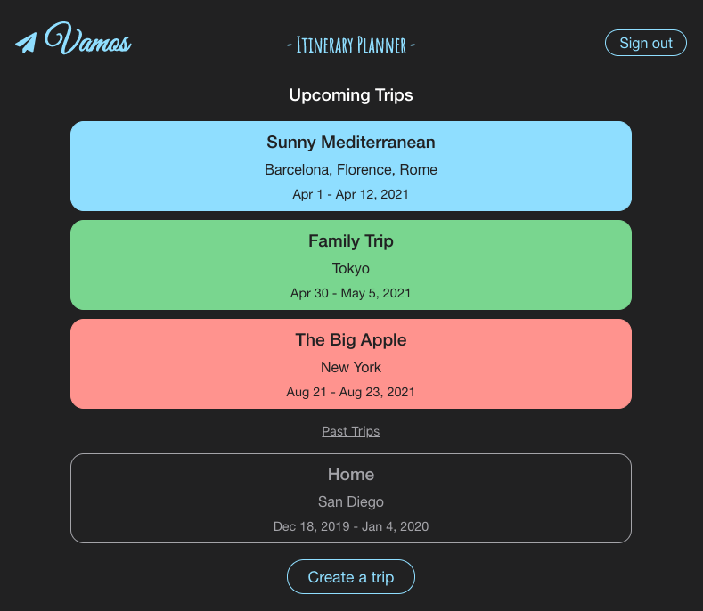
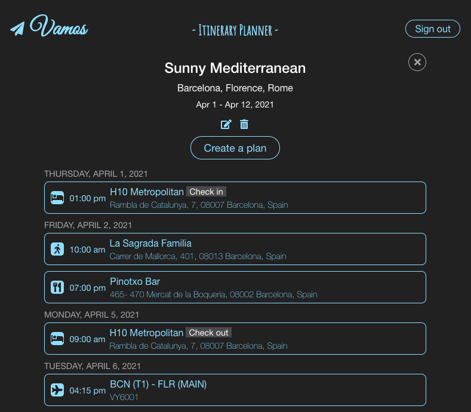
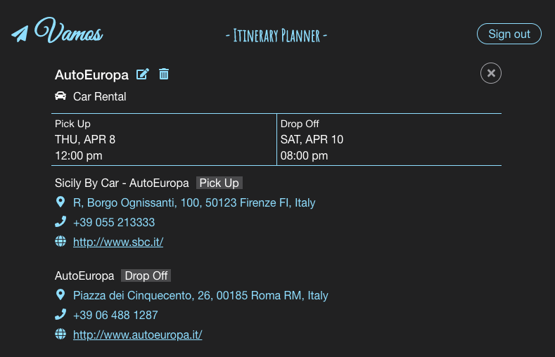

# Vamos - Itinerary Planner Client

Vamos is a full stack web application for managing travel itineraries. Users can create travel plans easily with autocomplete search for places and automatically fetched google places data.

This is the client-side code for the application with React, Node.js and google maps API.

## Live

- [Live Page](https://vamos-itinerary-planner.now.sh/)

## Server

- [Server Repo](https://github.com/asching7108/itinerary-planner-app-api/)

## Set Up

- Clone this repository to your local machine: `git clone REPO-URL NEW-PROJECTS-NAME`
- cd into the cloned repository
- Make a fresh start of the git history for this project: `rm -rf .git && git init`
- Install dependencies: `npm install`
- Prepare environment file: `cp example.env .env`
- Replace values in `.env` with your custom values

## Scripts

- Start application `npm start`
- Run tests: `npm test`

## Features

* Use authentication system
* Add / edit trips (multiple destinations supported)
* Add / edit plans for trip (different types of plans supported)
* Autocomplete for places
* Fetch detail information for places automatically
* Smartly display trip itineraries

## Screenshots

Homepage / My Trips:

Trip Itinerary: 

Plan Details:

## Technologies

* React
* Node.js
* JavaScript
* CSS
* Enzyme

## API

- [Google Maps API](https://developers.google.com/maps/documentation/javascript/tutorial/)